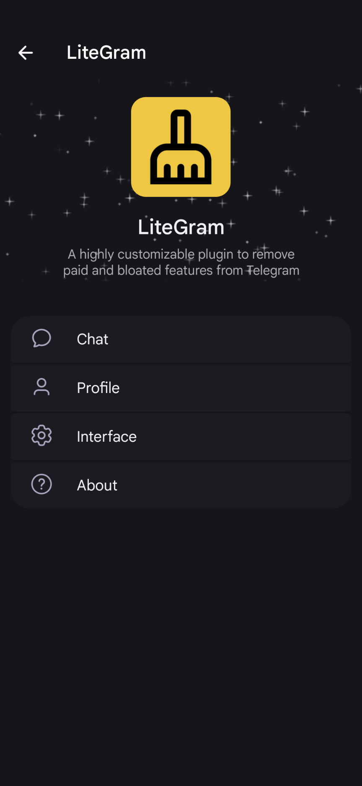
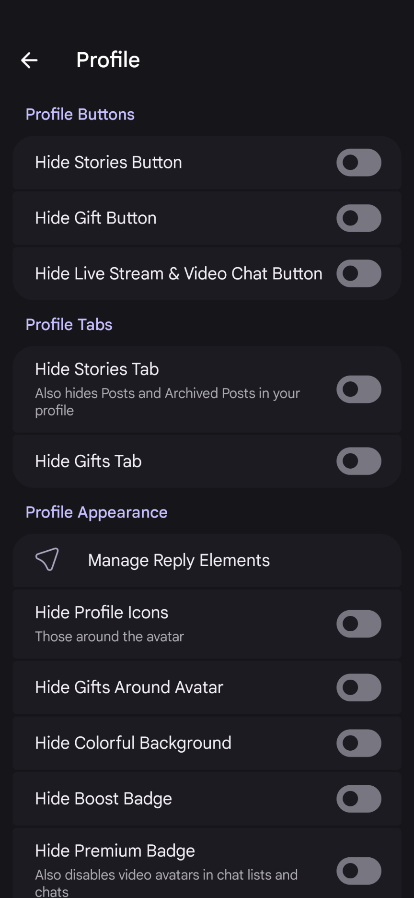
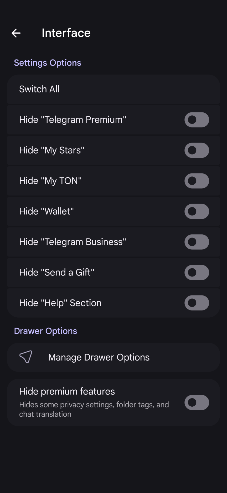

# LiteGram Plugin


A highly customizable, modular plugin for [exteraGram](https://exteragram.app) based clients designed to **remove paid and bloated features** from the Android Telegram client.

[Download from Official exteraGram Plugins Channel](https://t.me/exteraPluginsSup/789)

## Screenshots

| | | |
|:---:|:---:|:---:|
|  |  |  |

---

## Features

### 🚫 Premium Feature Bloat Hiding
- **Unified Toggle**: Toggle all core premium-locked sections in one click.
- **Voice Message Privacy**: Hides voice messages privacy settings menu.
- **Paid Messages Options**: Hides option to charge stars for messages, along with all premium subscription locked tags and "Learn more about Telegram Premium" links.
- **Folder Tags**: Hides custom folder tag colors and preview headers when editing chat list folders.
- **Auto-Translation**: Hides the auto-translation bar in chat headers and the translation prompt buttons.

### 🎨 Profile & Appearance Customization
- **Premium Badge & Boost Badge**: Hides premium star badges and group boost badges on user profiles and chat lists.
- **Custom Profile Layouts**: Hides custom colorful profile backgrounds, emoji wallpapers around avatars, and pinned gifts showcases.
- **Profile Action Buttons**: Hides buttons for Sending a Gift, Creating a Story, or starting a Live Stream directly from user profile pages.

### 💬 Chat & Input Fields Cleanup
- **Custom Emoji Hiding**: Hides custom/premium emojis in keyboard panels, reactions, searches, and quick suggestions.
- **Premium Stickers Hiding**: Hides premium-exclusive stickers from recent panels, search suggestions, and selector grids.
- **Gift Buttons & Cards**: Hides the Gift icon from message input fields, gift presentation cards in chats, and channel giveaways.
- **AI-Powered Tools**: Hides the entry field "AI" button and the premium chat summarization buttons.
- **Business Greeting Prompts**: Hides the Telegram Business greeting button prompt ("User set this message for all new chats").

### ⚙️ Main Settings & Menus Cleanup
- **Action Bar Cleanup**: Customizes the chat "three dots" menu, hiding items like Start Live Stream/Voice Chat, Archived Stories, Send Gift, Boost Group, or Add to Home Screen.
- **Telegram Premium Promos**: Hides "Telegram Premium" promotion rows, "My Stars" wallet, "My TON", "Wallet" integration, "Telegram for Business", and "Send a Gift" buttons.
- **Help Section**: Hides the native Telegram Help/FAQ section.

---

## Building

1. Clone the repository:
```bash
git clone https://github.com/nonFeature/LiteGram.git
cd LiteGram
```

2. Install dependencies using [uv](https://docs.astral.sh/uv/):
```bash
uv sync
```

3. Build the plugin:
```bash
# Production minified build
uv run build.py

# Non-minified debug build
uv run build.py --no-minify
```

The compiled plugin will be generated at `dist/LiteGram.plugin`.

---

## Installation

1. Send `LiteGram.plugin` to any Telegram chat (e.g., **Saved Messages**).
2. Tap on the file in the chat and tap **Install**.

---

## Debugging & Development

Refer to the [exteraGram plugins documentation](https://plugins.exteragram.app/docs/setup) and [CONTRIBUTING](CONTRIBUTING.md).

---

## License

This project is licensed under the **MIT License**. See the [LICENSE](LICENSE) file for details.

## Acknowledgements

- exteraGram Team - For the wonderful [Telegram fork](https://exteragram.app) and [Plugin System](https://plugins.exteragram.app/)
- [Xposed Hooks](https://github.com/LSPosed/LSPosed/blob/master/core/src/main/java/de/robv/android/xposed/XC_MethodHook.java)
